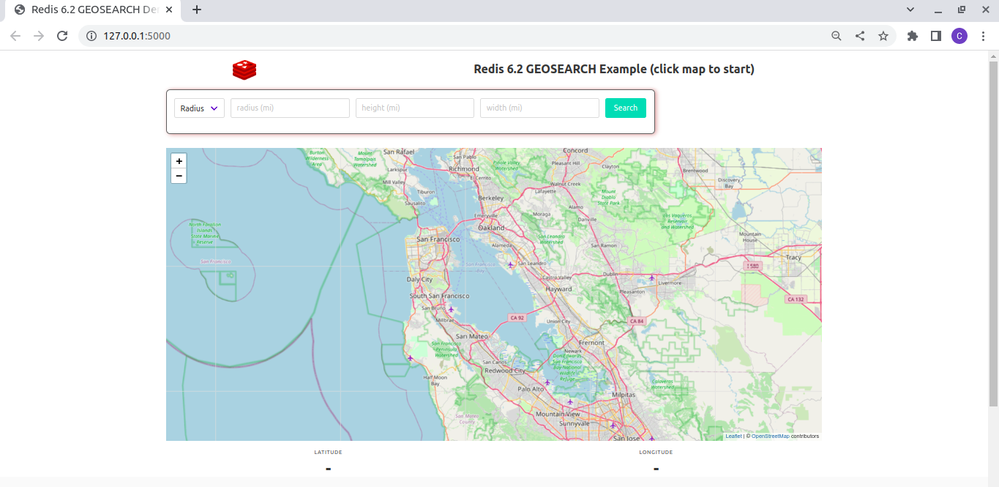

# Introducing the GEOSEARCH Command

This is the demo application to accompany the [Head in the Corner video on YouTube](https://www.youtube.com/watch?v=ZmzuIsWwAzM).

It's a small Python/[Flask](https://flask.palletsprojects.com/) application that uses the [Bulma](https://bulma.io/) CSS framework and [Leaflet](https://leafletjs.com/) maps in the front end.  The front end is built with vanilla JavaScript, so no build step is required :)

`GEOSEARCH` is a new command added in Redis 6.2 For more information, check out its [documentation at redis.io](https://redis.io/commands/geosearch).

This application demonstrates how to use `GEOSEARCH` as a replacement for the `GEORADIUS` command, and how to use the new box search functionality.

Want more Redis content?  Subscribe to our [YouTube channel](https://youtube.com/redisinc) for regular uploads!

## Setup

To run this example, you'll need Docker (for Redis 6.2) and Python 3 to run the Flask backend.  First, clone the repo:

```bash
$ git clone https://github.com/redis-developer/introducing-the-geosearch-command.git
$ cd introducing-the-geosearch-command
```

### Starting Redis 6.2

Next, start up a Redis 6.2 instance using the provided `docker-compose.yml`:

```bash
$ docker-compose up -d
Starting redis62_geosearch ... done
```

This will use port 6379, so if you have another instance of Redis on that port, you'll need to stop that first.

### Creating a Python Virtual Environment and Installing Dependencies

The backend and data loader use Python 3.  Create and activate a virtual environment, and install the dependencies:

```bash
$ python3 -m venv venv
$ . ./venv/bin/activate
(venv) $ pip install -r requirements.txt
```

### Load the Sample Data

The sample data provided consists of a KML file (`stations.kml`) containing 52 rail stations located around the San Francisco Bay area.  Load the data using the Python script provided:

```bash
(venv) $ python load_stations.py
Loaded 52 stations.
```

### Start the Application

The application is a Python / Flask application that listens on port 5000.  Start it as follows:

```bash
(venv) $ export FLASK_ENV=development
(venv) $ flask run
 * Environment: development
 * Debug mode: on
 * Running on http://127.0.0.1:5000/ (Press CTRL+C to quit)
 * Restarting with stat
 * Debugger is active!
 * Debugger PIN: 202-259-673
```

Now use your browser to go to `http://127.0.0.1:5000/` and you should see a map of the San Francisco Bay area:



### Perform Sample Queries

The interface allows you to perform radius and box queries.  To being either type, first click on the map at the location you want the query to center on.  A red marker will appear, and the latitude and longitude fields in the form will populate:


For a radius query:

* Select "Radius" from the drop down.
* Enter your desired radius in miles (e.g. 5).
* Click "Search".

Results will appear on the map, and you can hover over each station to see its name:


For a box query:

* Select "Box" from the drop down.
* Enter your desired box height and width in miles.
* Click "Search".

Results appear in the same way as for a radius search:


